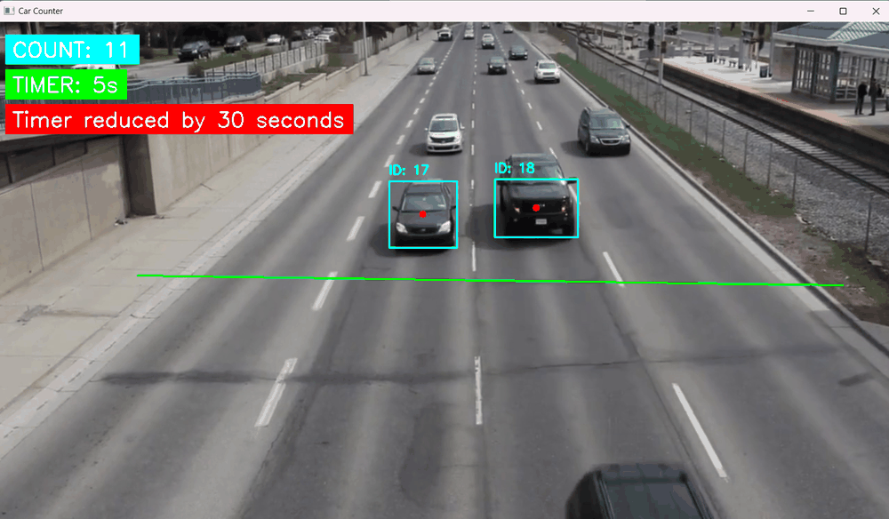

# Adaptive Traffic Signal Management (ATSM) — Vehicle Counting with YOLOv8 + SORT

[](./LICENSE)
[](./CC_LICENCE)
[](https://www.python.org/downloads/release/python-3123/)
[](https://docs.ultralytics.com/)
[](https://github.com/jambhaleAnuj/Traffic_signal_counter_using_car_count_python)
[](https://github.com/jambhaleAnuj/Traffic_signal_counter_using_car_count_python/issues)
[](https://github.com/jambhaleAnuj/Traffic_signal_counter_using_car_count_python/commits/main)
[](https://doi.org/10.5281/zenodo.16903140)



A lightweight research prototype that counts vehicles in a region-of-interest and adapts a simulated red-light timer based on real-time traffic density. Built with Ultralytics YOLOv8 for detection and SORT for object tracking.

This repository includes:

- Real-time vehicle detection and tracking using YOLOv8 + SORT
- Line-based vehicle counting and unique ID handling
- Dynamic signal timer reduction when congestion exceeds a threshold
- Example media and mask for quick local runs

Note: This is an unofficial research artifact and has not been peer reviewed. The source code is GPL-3.0; the accompanying paper is licensed under CC BY-SA 4.0 (see CC_LICENCE).

## Quickstart

- Supported OS: Windows, Linux, macOS
- Recommended Python: 3.12+

### 1) Create a virtual environment (Windows PowerShell)

```powershell
py -3.12 -m venv .venv ; .\.venv\Scripts\Activate.ps1
```

### 2) Install dependencies

```powershell
pip install --upgrade pip ; pip install -r requirements.txt
```

Tip: Installing PyTorch can be slow. If you have issues, install the recommended build from the official site for your CUDA/CPU, then re-run `pip install -r requirements.txt`.

### 3) Run the demo

```powershell
python car_counter.py
```

- The script reads `Media/cars2.mp4` and applies `Media/mask.png` as the region of interest.
- Press `q` to exit.

## How it works

- Detector: Ultralytics YOLOv8 (`Weights/yolov8n.pt` by default)
- Tracker: SORT (Kalman Filter + IOU-based association)
- Counting: A horizontal line (`count_line = [199, 363, 1208, 377]`) registers a vehicle when the tracked center crosses it.
- Signal logic: If the number of unique vehicles above the threshold (`car_count_threshold = 10`) is exceeded, the simulated red-light timer is reduced (`60s -> 30s`), with a simple cooldown to prevent oscillation.

You can change:

- Input video: update `video_path` in `car_counter.py`
- Model weights: swap to `Weights/yolov8l.pt` for higher accuracy
- Region mask or counting line: replace `Media/mask.png` and edit `count_line`

## File structure

- `car_counter.py` — main demo script (detection, tracking, counting, timer)
- `sort.py` — SORT tracker (GPLv3 by Alex Bewley)
- `Media/` — example video(s) and `mask.png`
- `Weights/` — YOLOv8 weights (small `yolov8n.pt`, large `yolov8l.pt`)
- `CC_LICENCE` — paper license (CC BY-SA 4.0)
- `LICENSE` — code license (GPL-3.0)

## Results preview

Below are sample outputs from the demo run:

.png)

.png)

.png)

.png)


## Advanced usage

Use the YAML config or override via CLI:

```powershell
# Use config.yaml (default)
python car_counter.py

# Point to a different config
python car_counter.py --config my_config.yaml

# Override key params
python car_counter.py --video Media/cars3.mp4 --weights Weights/yolov8l.pt --line 150 360 1200 360 --threshold 15 --normal 70 --reduced 40 --cooldown 15 --conf 0.4
```

## Paper and citation

- PDF: [Unofficial Research Paper](./Unoffical%20Research%20Paper.pdf)
- If you build on this work, please cite the repository (see `CITATION.cff`) and reference the accompanying unpublished paper:
  - Jambhale, Anuj. "Adaptive Traffic Signal Management (ATSM): Vehicle Counting with YOLOv8 + SORT." Unofficial research manuscript, 2025.

## License

- Source code: GPL-3.0 (see `LICENSE`). Includes `sort.py` from Alex Bewley (GPLv3).
- Paper and text in `CC_LICENCE`: CC BY-SA 4.0.
- Ultralytics YOLOv8 is licensed under AGPL-3.0 — see the [Ultralytics License](https://github.com/ultralytics/ultralytics/blob/main/LICENSE) for details.

## Acknowledgements

- Ultralytics YOLOv8: <https://github.com/ultralytics/ultralytics>
- SORT by Alex Bewley: <https://github.com/abewley/sort>

---

Have ideas or feedback? Open an issue using the templates or start a discussion. Contributions are welcome!
